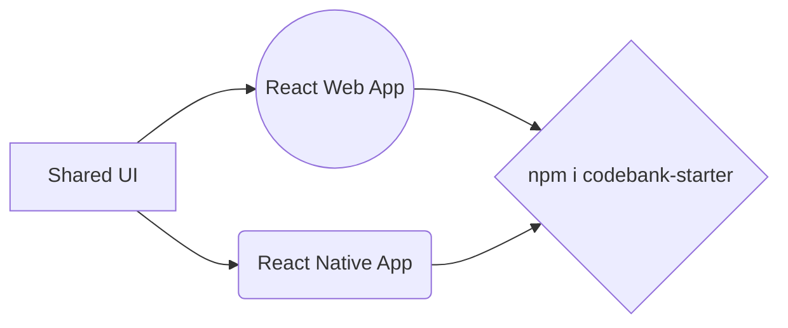

<h1 align="center">
  <a href="">
   Code Bank Starter 
    
  </a>
</h1>

  <strong>Install single Package</strong> 
  To Build Shared Workspace React and React Native Mobile App.

### 🎉 Building Your First Shared Workspace with React and React Native app 

Shared Workspace React Native Android, IOS &amp; React Web Starter

Follow Simple Steps 

1. `git clone https://github.com/kant146/codebank-starter.git`

2. `yarn install --frozen-lockfile`
3. `cd packages/web`
4. `yarn start`
5. `cd packages/native`
6. `yarn run android / npx expo start`
7. Follow <a href="https://github.com/kant146">Kant</a>

## 📋 Requirements
Node.js

React Native apps may target iOS 13.4 and Android 6.0 (API 23) or newer. You may use Windows, macOS, or Linux as your development operating system, though building and running iOS apps is limited to macOS. Tools like [Expo](https://expo.dev/) can be used to work around this.

Android Studio 

## Diagram

